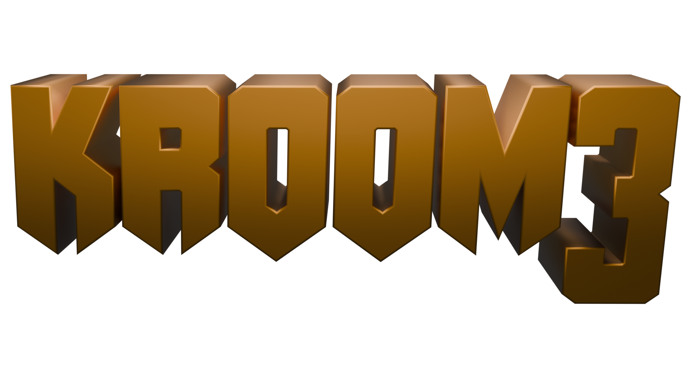

                                      "don't worry, you'll get your product"
                                                                            - Bertruger

Fork of TEKUUM source port aims to modernize DOOM 3 (2004) while also trying to mainting the same look of the game but giving more flexibility to modders, succesor of D3ModdingKit.

## About the Port

Fork of TEKUUM source port aims to modernize DOOM 3 (2004) while also trying to mainting the same look of the game but giving more flexibility to modders, succesor of D3ModdingKit.

While this is a D3ModdingKit succesor is not by any means a fully replacement for it but if you want a run down of what it currently has here's a list off features:

## Features

Some of these features are already redundant or they're not listed here yet and or they're not implemented, this list may be update when things are properly settled.

- fhDoom:
  - Refactor and UI Cleanup of DoomEdit.
  - Added con_size cvar to scale the console.
  - Removal of death code in various places.
  - Dmap timming stats.
- IcedTech / Darkligth:
  - Add MatBuild for mass texture creation.
  - Restore TypeInfoGen (Mostly for standolone games)
- StormEngine2
  - Support for "standard" cubemap side images.
- TEKUUM-D3 / RBDOOM3-BFG:
  - DoomEdit:
    - Window Snapping.
    - Mousewheel Support for cam window.
    - Tool window uses smaller title bar (more screen space for editing)
    - Cam Win Clip Point Manipulation.
    - Rotate Around Selection.
    - New Brush creation in Cam window.
    - Center on Selection.
    - Closing inspector dialog simply hides it.
    - Modified camera control.
    - BSP doesn't hide the Inspector's console.
    - Added Camera Background Color Selection.
    - Selection Centers views on entity.
    - Restore Command List windows.
  - Added Background music support for maps.
  - Added More Console Information.
  - Ambient Music for maps.
- The Dark Mod / Hardcorps
  - Re-implemented water system
- IcedTech3:
  - Removed legacy lighttris generation code.
  - Deprecated legacy async thread.
  - Fixed a bug were DoomEdit would have slow performance.
  - IceTech3: Fixed Particle Editor crashing when creating a new particle.
  - Fixed Multiplayer Not working after Async Removal.
  - Moved sound async to a separate thread.
  - Added OBJ support.
  - Moved AASfile to libs to match QuakeWars.
  - brush_t renamed to idEditorBrush and entity_t idEditorEntity.
  - Brushes will now be a single idRenderModel rather then each side of a brush also having its own render model.
  - Varius Changes for DoomEdit:
    * Added Proper Camera look for camera preview.
    * Surface properties are now accessed from the M key.
    * Camera movement is now based on delta time, and controled by radiant_cameraMoveSpeed.
    * Added grid lines.
  - Fixed a performance were idInteraction would allocate and link for objects that weren't in the light views frustum.
  - Fixed a bug were timing would be incorrect in loading screens.
  - Created native versions of all AI_events and then new script functions to call the new native events.
  - Moved Weapon DoomScript native functions so they can be called in native and just in doomscript.
  - Added AnimatedEntity.cpp/h moved that from Entity.cpp/h
  - idAnimState moved to AnimState.cpp/h
  - Seperated idEntity doomscript functions so they can be called in native.
  - Seperated DoomScript from idActor so it can be used with native.
  - Re-Added MayaImport:
    * Supports Maya SDK 2019 up to 2025 (2019 Below is untested)
  - Gamesys integration from Quake 4/Quake Wars. Prevents dead stripping, and new state management code.
- com.n0n3m4.diii4a:
  - Quake 4's map base .reverb config files for maps + default .efx for maps that lacks it.
- Original Changes:
  - Support for source engine skyboxes base on StormEngine2 Changes.
  - fixed noSpecular flag for lights Base on a dhewn3 rejected PR.
  - Enable Common Controls theme engine for the tools.
  - D3XP And Game dlls are in one folder.
  - WIP Template base for TC Games.
  - Update The Sys Console to use different colors and font.
  - Restored Footsteps sounds by using Prey 06 Code.
  - Set gui_mediumFontLimit and gui_smallFontLimit to "0"
  - Added Missing Material Editor models.
  - Added .guide Support from Quake 4.
  - Refactored MFC Tools.
  - Backported fixes from d3xp and merge missed changes in d3xp/ from base/
  - Backported Water bullet impact from RoE ( see Examples/ folder for the water particle)
  - Made the player be in thirdperson when they die in multiplayer.
  - Rename g_showPlayerShadow to g_showExtraShadows and make it default.
  - Added decl_warn_duplicates so warnings about duplicated entries are hide.
  - Removed TakeNotes system.
  - Added doxygen support.
  - Improved GUIEditor base on the idtech4sdk project.
  - Restored "mphud" keyvalue in player.def
  - Remove unused game over gui file.
  - Added blender model I/O scripts.

# ".plan" 

Currently there's not a .plan set in stone there's a lot of things that i want to get going like:

- Fixing the editors mainly IdStudio, MaterialEditor, GuiEditor
- Reintroduce IMGUI from RBDOOM3BFG
- Re-introduce .bmtrs has it was present on the original TEKUUM
- Evaluate if is worth to re-introduce json map export and other mapping utilities.
